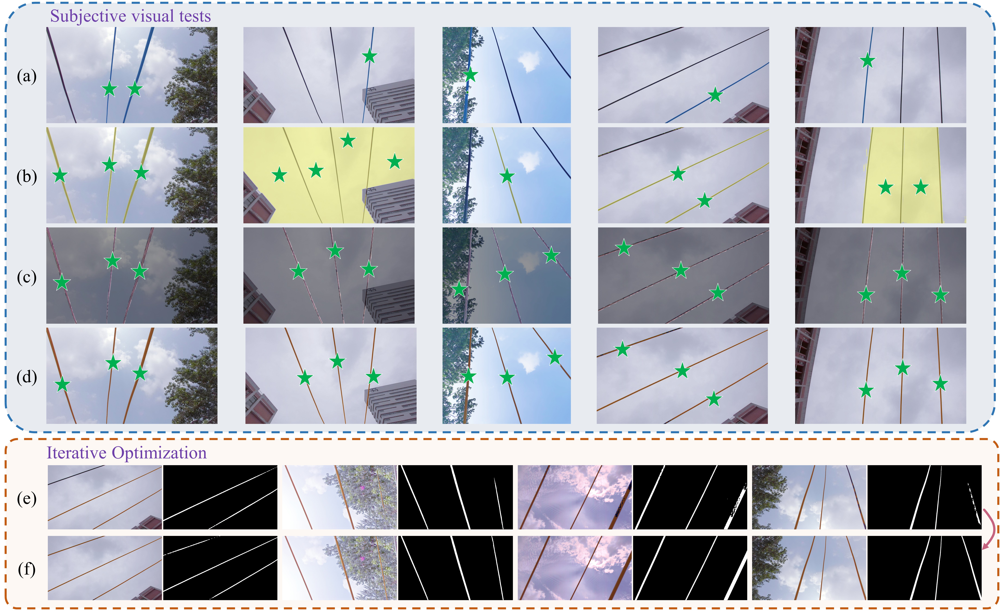

  # Project Title

One-Shot Power Line Localization for Live-Line Robots with LEO-DCE and MSIO-SAM .

## Introduction
We introduces a novel approach combining the Lightweight Encoder-Only DCE (LEO-DCE) for low-light enhancement and the Multi-Scale Interactive Object Segmentation with SAM (MSIO-SAM) for precise power line segmentation and localization. LEO-DCE, a state-of-the-art low-light enhancement network with only 2.7k parameters and a processing speed of 1000 fps on 2k images, addresses sunlight interference by significantly improving the visibility of power lines. MSIO-SAM, building on the large-data Segment Anything Model (SAM), incorporates multi-scale similarity analysis and iterative optimization to achieve optimal performance across multiple dimensions, including IoU and False Negative Rate (FNR).

## low-light images enhancement

    

 (0) is the input low-light image; (a)–(f) represent the output enhanced images using Enlighten GAN, RUAS, SCI, URetinex-Net, Zero-Dce++, Zero-DCE, and LEO-DCE, respectively, where the right image with the red box shows its detail magnification
 
## msio-SAM

    

(a–d) represent the image segmentation results by PerSAM (blue masks), Matcher (yellow masks), SegGPT (red masks), and MSIO-SAM (orange masks) respectively; (e) shows the MSIO-SAM results before applying iterative optimization; (f) shows the MSIO-SAM results after applying iterative optimization. The green stars indicate the recognized targets. 

## image segment dataset
We constructed the industry's first dataset containing 1,000 annotated power line images
You can download [Power Line Dataset](https://pan.baidu.com/s/12rgBK3bSSQyvwSR-pPa19w).Extraction codeis:yght
